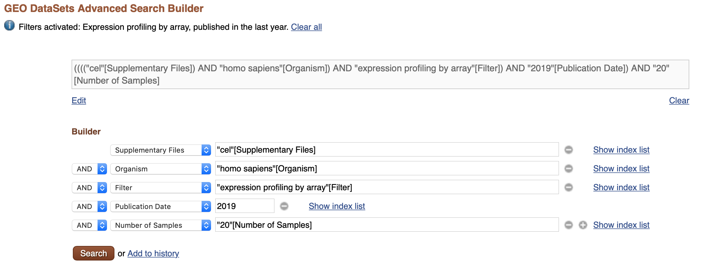
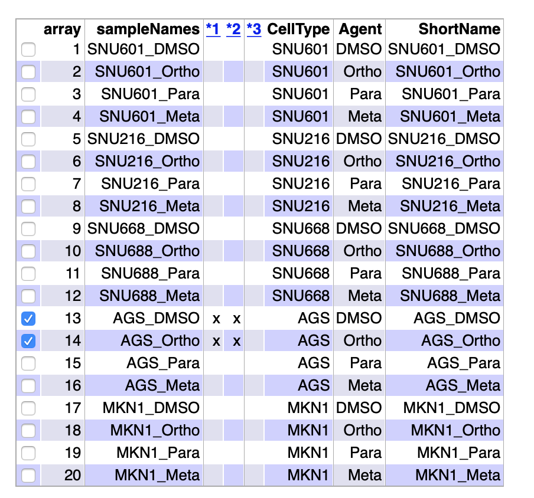
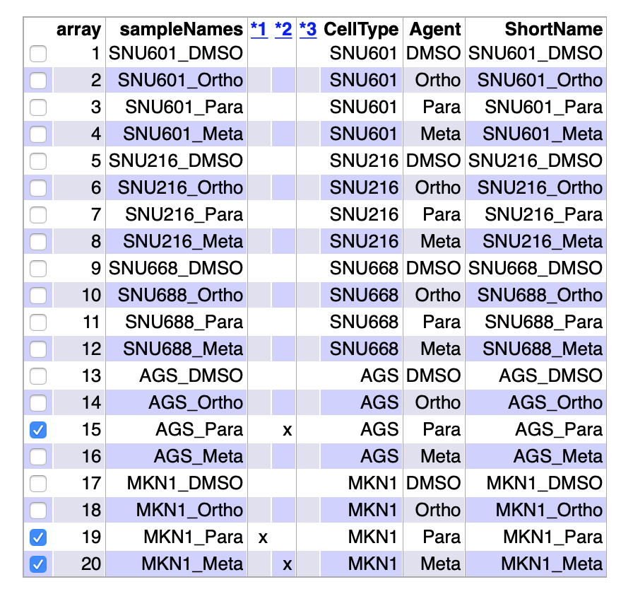
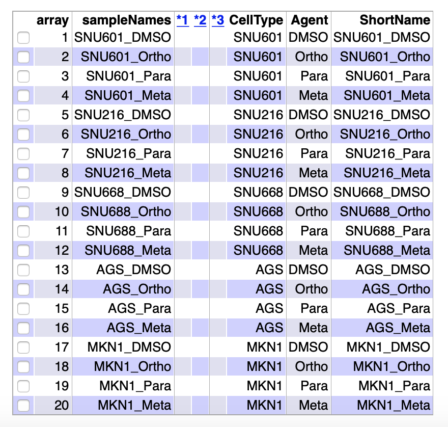

```{r setup, include=FALSE}
library(knitr)
knitr::opts_chunk$set(echo = FALSE, message = FALSE, warning = FALSE, 
                      comment = NA, prompt = TRUE, tidy = FALSE, 
                      fig.width = 7, fig.height = 7, fig_caption = TRUE,
                      cache=FALSE)
```

\newpage

#ABSTRACT

Este informe esta basado en un estudio de Kim *et al.* [-@Kim] sobre el efecto de posibles antagonistas del factor de transcripción HNF4$\alpha$, relacionado con tumores gástricos en humanos. Se ha medido la actividad biológica de este antagonista y sus derivados en diferentes lineas celulares tumorales. Los resultados muestran que el derivado *Para* de BI6105 es el único capaz de inhibir algunas rutas oncogénicas.

Todos los ficheros con los datos y el código utilizados para generar este informe se pueden encontrar en un repositorio de github.^[https://github.com/adurana/ADO_PEC1]

#OBJETIVOS

El principal objetivo de este trabajo es estudiar los efectos en la señalización antineoplásica de un conocido inhibidor del factor de transcripción HNF4$\alpha$ y de sus derivados.

Para ello se medirá la actividad biológica mediante la eficacia antimitogénica frente a varias lineas celulares de cáncer gástrico. Los genes expresados diferencialmente se seguirán por análisis de las rutas de señalización oncogénicas.

Por otra parte, el objetivo de esta PEC1 es la realización de un análisis de datos de microarray de una manera lo más fiel posible a la realidad. De este modo, es posible aplicar los conocimientos teoricos adquiridos a un caso práctico.

#MATERIALES Y MÉTODOS

##Software

Para la realización de este informe se ha utilizado [R](https://cran.r-project.org/index.html) (versión 3.6.2) y el interfaz [RStudio](https://www.rstudio.com/). Los paquetes específicos para el análisis de datos de microarrays se han obtenido del proyecto [Bioconductor](https://www.bioconductor.org/) (versión 3.6) que engloba los paquetes para análisis de datos ómicos más habituales.

##Datos

Los datos públicos utilizados para este estudio se han conseguido de la base de datos Gene Expression Omnibus ([GEO](https://www.ncbi.nlm.nih.gov/geo/browse/?view=series)) con el código GSE114626. Se trata de un experimento de arrays de perfil de expresión en el que se utilizan arrays Human Gene 2.0 ST de Affymetrix (código de plataforma: GPL16686). En concreto son 20 muestras de arrays que se generan a partir de un diseño experimental de dos factores: agentes inhibidores (4 niveles) y líneas celulares (5 niveles).

##Workflow y métodos

El procedimiento general del análisis se puede resumir en los siguientes pasos. En cada paso se resume el tipo de tarea realizado y los métodos utilizados.

1. Preparación del entorno: Creación de directorios de trabajo.
2. Obtención de datos: De la base de datos GEO con `getGEO()`. Creación del fichero *targets.csv*.
3. Lectura de datos: Generación de un objeto ExpressionSet (`rawData`) a partir de los ficheros *.CEL*.
4. Control de calidad de datos crudos: Tanto a nivel numérico (`arrayQualityMetrics()`) como gráfico (PCA, boxplot, cluster).
5. Normalización de datos: Usando el método RMA para generar un ExpressionSet con datos normalizados (`eset_rma`).
6. Control de calidad de datos normalizados: Análogo a lo realizado con los datos crudos.
7. Detección de genes más variables: De manera gráfica mediante un plot de desviaciones estándar.
8. Filtrado de genes: Filtrado de los genes menos variables (`nsFilter()`) y generación de un ExpressionSet con datos filtrados (`eset_filtered).
9. Control de calidad de datos filtrados: Análogo a lo realizado con los datos crudos.
10. Diseño experimental: Creación de la matriz de diseño y de la matriz de contraste.
11. Modelización y selección de genes: Ajuste del modelo lineal (`limma()`) y selección de genes.
12. Listado de genes diferencialmente expresados: Obtención de listas de genes (`topTable()`) para cada una de las hipótesis a contrastar.
13. Anotación de genes: Uso de ficheros de anotación para completar los listados de genes.
14. Visualización de la expresión diferencial: Volcano plot.
15. Comparaciones múltiples: Diagramas de Venn y heatmaps.
16. Significación biológica de los resultados: Uso del método *Gene Enrichment Analysis* y del paquete `ReactomePA` para ayudar a interpretar los resultados desde un punto de vista biológico.
17. Resumen de resultados: Listado de los ficheros de resultados generados.

\pagebreak


#RESULTADOS Y DISCUSIÓN

En esta sección se detallarán los resultados obtenidos en el análisis siguiendo el workflow descrito anteriormente. El código utilizado para realizar el análisis no se mostrará y solo se mostrarán los resultados más relevantes. Todo el código empleado para la realización del análisis se podrá encontrar en el apéndice que se encuentra al final de este informe además de en el repositorio de github mencionado anteriormente.^1^ Hay que señalar que gran parte del análisis esta basado en uno similar disponible en los materiales de la asignatura.^[https://github.com/ASPteaching/Omics_Data_Analysis-Case_Study_1-Microarrays]

##Preparación del entorno

Antes de descargar los datos y comenzar con el análisis es recomendable preparar el entorno de trabajo. Tras elegir el directorio de trabajo `workingDir`, se crearon los directorios para los datos `dataDir` y los resultados `resultsDir`.

```{r preparacion del entorno, eval=FALSE}
setwd("~/Desktop/Master UOC/Semestre 3/Asignaturas/157-Analisis de datos omicos/PEC1/ADO_PEC1")
workingDir <- getwd()
dir.create("data")
dir.create("results")
dataDir <- file.path(workingDir, "data/")
resultsDir <- file.path(workingDir, "results/")
```


##Obtención de datos

Como se ha mencionado anteriormente, los datos se obtuvieron de la base de datos de [GEO](https://www.ncbi.nlm.nih.gov/geo/browse/?view=series). Para ello se realizó una busqueda para acotar los resultados con ciertos parámetros de interés como tipo de experimento, organismo, fecha de publicación y otros (Figure 1). De entre los resultados de esta búsqueda se eligió el estudio GSE114626 de Kim *et al.* [-@Kim].


```{r busqueda GEO, out.width="100%", fig.align="center", fig.cap="Parámetros de busqueda en GEO"}

```


Para la obtención de los datos se utilizó el paquete `GEOquery`, en concreto la función `getGEO()` para descargar los datos del experimento y `getGEOSuppFiles()` para descargar los ficheros *.CEL*.

```{r obtencion de datos libreria}
library(GEOquery)
```


```{r obtencion de datos, eval=FALSE}
my_gse <- getGEO(GEO = "GSE114626", destdir = dataDir)
getGEOSuppFiles(GEO = "GSE114626", makeDirectory = F, baseDir = dataDir)
```

A pesar de intentar generarlo automáticamente a partir de la información descargada con `getGEO()`, al final opté por crear el fichero *targets.csv* de manera manual.

En el estudio se observa el efecto de 3 agentes inhibidores (Ortho, Meta y Para) y un control (DMSO) sobre la expresión génica en cinco líneas celulares tumorales (SNU601,SNU216, SNU668, AGS y MKN1). Esto da como resultado 20 muestras diferentes que son las que se resumen en el fichero *targets.csv* (Table 1). Las columnas de este fichero son *FileName* para el nombre del fichero *.CEL*, *CellType* para la línea celular, *Agent* para el agente inhibidor y *ShortName* para el código de cada muestra.

```{r fichero targets}
targets <- read.csv2("./data/targets.csv", header = TRUE, sep = ";") 
knitr::kable(
  targets, booktabs = TRUE,
  caption = 'Contenido del fichero *targets.csv* para el estudio GSE114626')
```


##Lectura de datos

Para poder trabajar con los datos descargados, es necesario leerlos y guardarlos como un objeto en *R*. Para ello son necesarios los paquetes `Biobase`, `oligo` y el paquete de anotaciones `pd.hugene.2.0.st` debido al array utilizado en este caso. A continuación se leyeron los ficheros *.CEL* con la función `list.celfiles()` y el fichero *targets.csv* con la función `read.AnnotatedDataFrame()`. Estos dos objetos se combinaron para generar el objeto ExpressionSet `rawData` utilizando la función `read.celfiles()`. Tras modificar los nombres de las columas, se obtuvo el objeto `rawData` listo para su análisis.

```{r lectura de datos librerias}
library(Biobase)
library(oligo)
library(pd.hugene.2.0.st)
```


```{r lectura de datos codigo, results='hide'}

celFiles <- list.celfiles("./data", full.names = T) #get list of .cel files
my.targets <- read.AnnotatedDataFrame(file.path("./data", "targets.csv"), 
                                      header = T, row.names = 1, sep = ";")
rawData <- read.celfiles(celFiles, phenoData = my.targets) #reads .cel files
pData(rawData)
my.targets@data$ShortName -> rownames(pData(rawData)) #change names of the samples
colnames(rawData) <- rownames((pData(rawData)))
rawData

```


##Control de calidad de datos crudos

En este paso del análisis se comprobará si los datos crudos tienen calidad aceptable para continuar con el análisis o ha habido algún tipo de problema serio a la hora de recoger los datos o de realizar los experimentos.

Este control de calidad se realizó de manera gráfica pero también de una manera más exhaustiva utilizando el paquete `arrayQualityMetrics`. Este paquete realiza diferentes controles de calidad e indica si alguna de las muestras se puede considerar un *outlier* en alguna categoria (Figure 2).

```{r control de calidad de datos crudos libreria}
library(arrayQualityMetrics)
```


```{r control de calidad de datos crudos, eval=FALSE}
arrayQualityMetrics(rawData, outdir = file.path("./results", "QCDir.Raw")) 
```

```{r control de calidad de datos crudos resultados, out.width="50%", fig.align="center", fig.cap="Resumen de resultados del fichero index.html para el análisis por arrayQualityMetrics de los datos crudos"}

```

En este resumen se observa que hay dos muestras (AGS_DMSO y AGS_Ortho) que cuentan con dos outliers cada una. Esto, de momento, no deberia ser problema para conseguir normalizar los datos correctamente pero si surgiera algún problema durante el análisis posterior habría que revisar estas dos muestras.

En cuanto al análisis gráfico de los datos crudos, se decidio realizar un boxplot (Figure 3), un cluster jerárquico (Figure 4) y un análisis de componentes principales (PCA, Figure 5). Para este último plot, se creo una función específica `plotPCA3()` cuyo código se encuentra, como el resto, en el apéndice al final del informe.


```{r control de calidad de datos crudos librerias plot}
library(ggplot2)
library(ggrepel)
```


```{r control de calidad de datos crudos boxplot, out.width="60%",fig.align="center", fig.cap="Boxplot de intensidad de arrays: datos crudos"}
boxplot(rawData, cex.axis = 0.5, las=2, which="all", main="",
        col = c(rep("red", 4), rep("blue", 4), rep("green", 4), rep("yellow", 4), rep("magenta", 4)))
```

En el boxplot se observa que la distribución de la intensidad en las muestras es bastante similar en todos los casos por lo que no parece que haya problemas con los datos.

```{r control de calidad de datos crudos cluster, out.width="50%",fig.align="center", fig.cap="Cluster jerárquico de datos crudos"}
plot(hclust(dist(t(exprs(rawData)))))
```

En cuanto al cluster, se observa que no hay una jerarquia clara entre las muestras. Esto puede ser debido a que estamos tratando con datos crudos.

```{r control de calidad de datos crudos funcion PCA}
plotPCA <- function(datos, labels, factor, scale, 
                     colores, size = 1.5, glineas = 0.25) {
  data <- prcomp(t(datos), scale = scale)
  dataDF <- data.frame(data$x)
  Group <- factor
  loads <- round(data$sdev^2/sum(data$sdev^2)*100, 1)
  p1 <- ggplot(dataDF, aes(x=PC1, y =PC2)) +
    theme_classic() +
    geom_hline(yintercept = 0, color = "gray70") +
    geom_vline(xintercept = 0, color = "gray70") +
    geom_point(aes(color = Group), alpha = 0.55, size = 3) +
    coord_cartesian(xlim = c(min(data$x[,1])-5, max(data$x[,1])+5)) +
    scale_fill_discrete(name = "Group")
  #avoiding labels superposition
  p1 + geom_text_repel(aes(y = PC2 + 0.25, label = labels), segment.size = 0.25, size = size) +
    labs(x = c(paste("PC1", loads[1], "%")), y = c(paste("PC2", loads[2], "%"))) +
    theme(plot.title = element_text(hjust = 0.5)) +
    scale_colour_manual(values = colores)
}

```


```{r control de calidad de datos crudos PCA, out.width="65%", fig.align="center",fig.cap="Análisis de componentes principales de datos crudos"}
plotPCA(exprs(rawData), labels = my.targets@data$ShortName, factor = my.targets@data$Agent,
        scale = F, size = 3, colores = c("red", "blue", "green", "yellow"))
```

En el plot de componentes principales (PCA) se observa que los dos primeros componentes explican practicamente el mismo porcentaje de variabilidad con un 16.2% y un 14.9% respectivamente. Esto indica que el factor *Agent* y el factor *CellType* tienen una importancia similar en la variabilidad de los datos. Además son porcentajes bastante bajos, lo que quiere decir que hay muchos más factores que no se contemplan pero que tiene una influencia grande en la variabilidad. Hay que señalar que exceptuando dos muestras, el resto se encuentran muy cerca lo que indica que son muy similares entre si.

Con estos resultados obtenidos del control de calidad en los datos crudos, se decidió que los datos eran lo suficientemente buenos como para poder continuar el análisis.

##Normalización de datos

La etapa de normalización se basa en la necesidad de hacer los arrays más comparables entre sí minimizando la variabilidad de las muestras debida a razones técnicas o de análisis. El proceso de normalización pretende asegurar que las diferencias de intensidades presentes en los arrays sea debido sólo a razones biológicas y que las observaciones sean reflejo de la expresión diferencial de los genes. En este caso se ha utilizado para el análisis el método Robust Multichip Analysis (RMA) desarrollado por Irizarry *et al.* [-@Irizarry] que es el más habitual en la actualidad.

Para normalizar los datos se creó un nuevo objeto ExpressionSet `eset_rma` con la función `rma()`. 

```{r normalizacion de datos, results='hide'}
eset_rma <- rma(rawData)
```


##Control de calidad de datos normalizados

En este punto se realizó un análisis similar al realizado para los datos crudos.

```{r control de calidad de datos normalizados, eval=FALSE}
arrayQualityMetrics(eset_rma, outdir = file.path("./results", "QCDir.Norm"))
```

En los resultados de `arrayQualityMetrics()` se observó una mejora de los indicadores de calidad con respecto a los datos crudos dado que ya no hay ninguna muestra con dos outliers (Figure 6).

```{r control de calidad de datos normalizados resultados, out.width="50%", fig.align="center", fig.cap="Resumen de resultados del fichero index.html para el análisis por arrayQualityMetrics de los datos normalizados"}

```

Se realizó el mismo análisis gráfico que para los datos crudos. En el boxplot (Figure 7) se observa que la distribución de la intensidad en las muestras ha mejorado con respecto a los datos crudos, lo que es indicativo de que la normalización ha funcionado correctamente.


```{r control de calidad de datos normalizados boxplot, out.width="60%", fig.align="center",fig.cap="Boxplot de intensidad de arrays: datos normalizados"}
boxplot(eset_rma, cex.axis = 0.5, las=2, which="all",
        col = c(rep("red", 4), rep("blue", 4), rep("green", 4), rep("yellow", 4), rep("magenta", 4)))
```

En cuanto al cluster (Figure 8), se observa que las muestras se encuentran más organizadas que en caso de los datos crudos. Parece que hay cierta jerarquización en torno a las muestras que utilizan el agente *Para*.

```{r control de calidad de datos normalizados cluster, out.width="50%",fig.align="center",fig.cap="Cluster jerárquico de datos normalizados"}
plot(hclust(dist(t(exprs(eset_rma)))))
```

En el plot de componentes principales (Figure 9) se observa que las muestras *Ortho*, *Meta* y *DMSO* para cada una de las líneas celulares se encuentran agrupadas mientras que las muestras *Para* están muy alejadas del resto de las muestras para cada una de la líneas celulares. Esto es indicativo del comportamiento singular de las muestras que utilizan el agente *Para*. Además hay que señalar que los porcentajes de variabilidad han aumentado ligeramente pero que prácticamente no hay diferencia con los observados para los datos crudos.

```{r control de calidad de datos normalizados PCA, out.width="65%",fig.align="center",fig.cap="Análisis de componentes principales de datos normalizados"}
plotPCA(exprs(eset_rma), labels = my.targets@data$ShortName, factor = my.targets@data$Agent,
         scale = F, size = 3, colores = c("red", "blue", "green", "yellow"))
```


##Detección de genes más variables

Es esperable que los genes diferencialmente expresados muestren ciertas diferencias entre muestras por lo que la varianza de estos genes debería ser superior a la de los genes que no expresan diferencialmente. Una manera sencilla de observar esta diferencia es la representación de la desviación estándar de todos los genes (Figure 10) de modo que se pueda decidir a partir de que porcentaje de desviación estándar un grupo de genes se puede considerar como diferencialmente expresado. Las líneas verticales del gráfico representan los percentiles 90% y 95%.


```{r deteccion de genes mas variables, out.width="60%", fig.align="center", fig.cap="Distribución de la variabilidad de todos los genes"}
sds <- apply(exprs(eset_rma), 1, sd)
sds0 <- sort(sds)
plot(1:length(sds0), sds0, xlab="Genes desde el menos al más variable", ylab="Desviación estándar")
abline(v=length(sds)*c(0.9,0.95))
```


##Filtrado de genes

El filtrado de genes con poca variabilidad o con variabilidad atribuible a efectos aleatorios pueden ser filtrados de la población de genes total para un aumento de la potencia del análisis [@Hackstadt]. Para realizar esto se utiliza la función `nsFilter()` del paquete `genefilter` que permite filtrar genes utilizando un umbral de variabilidad. Además el uso de un paquete de anotaciones, como `hugene20sttranscriptcluster.db` para este caso, permite desechar los genes sin un identificador asociado. El objeto ExpressionSet creado se ha guardado como `eset_filtered`.

```{r filtrado de genes librerias}
library(genefilter)
library(hugene20sttranscriptcluster.db)

```

```{r filtrado de genes}

annotation(eset_rma) <- "hugene20sttranscriptcluster.db"
filtered <- nsFilter(eset_rma,
                     require.entrez = T, remove.dupEntrez = T,
                     var.filter = T, var.func = IQR, var.cutoff = 0.75,
                     filterByQuantile = T, feature.exclude = "^AFFX")

eset_filtered <- filtered$eset
```


##Control de calidad de datos filtrados

De modo idéntico al caso de los datos crudos y normalizados, se realizó un análisis de los datos filtrados.


```{r control de calidad de datos filtrados, eval=FALSE}
arrayQualityMetrics(eset_filtered, outdir = file.path("./results", "QCDir.Filt"))
```


```{r control de calidad de datos filtrados resultados, out.width="50%", fig.align="center", fig.cap="Resumen de resultados del fichero index.html para el análisis por arrayQualityMetrics de los datos fitrados"}

```

En los resultados de `arrayQualityMetrics()` (Figure 11) se observó una mejora de los indicadores de calidad dado que no hay ninguna muestra con outliers.


```{r control de calidad de datos filtrados boxplot, out.width="60%", fig.align="center",fig.cap="Boxplot de intensidad de arrays: datos filtrados"}
boxplot(eset_filtered, cex.axis = 0.5, las=2, which="all",
        col = c(rep("red", 4), rep("blue", 4), rep("green", 4), rep("yellow", 4), rep("magenta", 4)))
```

En el boxplot de los datos filtrados (Figure 12) no se observan cambios significativos.


```{r control de calidad de datos filtrados cluster, out.width="50%",fig.align="center",fig.cap="Cluster jerárquico de datos filtrados"}
plot(hclust(dist(t(exprs(eset_filtered)))))
```


En cuanto al cluster jerárquico (Figure 13), se observa una jeraquización mucho más elevada que en el caso de los datos normalizados. En concreto, y como parecian apuntar los datos normalizados, todas las muestras con agente *Para* se encuentran en un cluster mientras que el resto de las muestras se organizan por líneas celulares.

```{r control de calidad de datos filtrados PCA, out.width="65%",fig.align="center",fig.cap="Análisis de componentes principales de datos filtrados"}
plotPCA(exprs(eset_filtered), labels = my.targets@data$ShortName, factor = my.targets@data$Agent,
         scale = F, size = 3, colores = c("red", "blue", "green", "yellow"))
```

En el plot de componentes principales de datos filtrados (Figure 14) se observa un comportamiento muy similar al observado en el cluster: las muestras *Para* se encuentran separadas del resto de las muestras que se agrupan por líneas celulares.

Antes de continuar con el análisis y debido a que los datos filtrados son el punto de partida de diferentes análisis, suele ser conveniente guardarlos por si hubiera que volver a ellos. Para ello se crean los ficheros *normalized.Data.csv* para datos normalizados, *filtered.Data.csv* para datos filtrados y *normalized.filtered.Data.Rda* para el conjunto de los datos normalizados y filtrados como un objeto *R*.


```{r guardar ficheros, eval=FALSE}
write.csv(exprs(eset_rma), file = "./results/normalized.Data.csv")
write.csv(exprs(eset_filtered), file = "./results/filtered.Data.csv")
save(eset_rma, eset_filtered, file = "./results/normalized.filtered.Data.Rda")
```


##Diseño experimental

Seleccionar genes diferencialmente expresados consiste básicamente en realizar algún tipo de test o de comparación estadística entre diferentes grupos. Existes numerosos métodos que permiten hacerlo pero el más utilizado es el método de modelos lineales para microarrays implementado en el paquete `limma` desarrollado por Smyth [-@Smyth]. 

El primer paso de este método es crear la matriz de diseño (`designMat`), que simplemente describe las condiciones experimentales aplicables a cada muestra. Un valor 1 significa que la muestra (filas) pertenece a un grupo concreto (columnas), mientras que el valor 0 significa que no pertenece a ese grupo. En este caso se ha generado la matriz agrupando las muestras por agente inhibidor y se ha almacenado en la variable `designMat`.

```{r diseño experimental libreria}
library(limma)

```

```{r diseño experimental matriz de diseño}
designMat <- model.matrix(~0+Agent, pData(eset_filtered))
colnames(designMat) <- c("DMSO", "Meta", "Ortho", "Para")

```

```{r diseño experimental matriz de diseño matriz, echo=TRUE}
designMat
```

El segundo paso es crear la matriz de contrastes. Esta matriz se usa para definir los contrastes entre diferentes muestras sobre los que se quiere realizar una comparación. En el fondo, no es otra cosa que definir las hipótesis nulas que interese estudiar. En este caso, y debido a que aparentemente el agente *Para* tiene un comportamiento diferente, los contrastes a estudiar serían los siguentes:

* Para - Ortho = *PvsO*
* Para - Meta = *PvsM*
* Para - DMSO = *PvsD*

Estos contrastes se han almacenado en la variable `cont.matrix`.

```{r diseño experimental matriz de comparaciones}

cont.matrix <- makeContrasts(PvsO = Para-Ortho,
                             PvsM = Para-Meta,
                             PvsD = Para-DMSO,
                             levels = designMat)
```

```{r diseño experimental matriz de comparaciones matriz, echo=TRUE}
cont.matrix
```

##Modelización y selección de genes

Para ajustar el modelo se utilizó la función `lmFit()` del paquete `limma` utilizando el ExpressionSet de datos filtrados y las dos matrices del diseño. Además también se añaden al análisis modelos empiricos bayesianos que mejoran la estimación de los errores [@Smyth]. Este método proporciona p-valores ajustados que permiten controlar el porcentaje de falsos positivos al usar el método de Benjamini y Hochberg [@Benjamini]. Todo este análisis se almacena en el objeto `fit.main`.

```{r modelizacion y seleccion de genes}

fit <- lmFit(eset_filtered, designMat)
fit.main <- contrasts.fit(fit, cont.matrix)
fit.main <- eBayes(fit.main)
```

##Listado de genes diferencialmente expresados

La función `topTable()` implementada en el paquete `limma` devuelve una lista de genes en orden ascendente de p-valores para cada contraste, por lo que se puede considerar que los primeros genes de esta lista son los más diferencialmente expresados. Se muestran las primeras filas de los listados `topTab_PvsO` para el contraste *PvsO*, `topTab_PvsM` para el contraste *PvsM* y `topTab_PvsD` para el contraste *PvsD*. 

```{r listado de genes diferencialmente expresados}
topTab_PvsO <- topTable(fit.main, number = nrow(fit.main),
                               coef="PvsO", adjust="fdr")

topTab_PvsM <- topTable(fit.main, number = nrow(fit.main),
                             coef="PvsM", adjust="fdr")

topTab_PvsD <- topTable(fit.main, number = nrow(fit.main),
                       coef="PvsD", adjust="fdr")

```


```{r listado de genes diferencialmente expresados listados, echo=TRUE}
head(topTab_PvsO)

head(topTab_PvsM)

head(topTab_PvsD)
```

Se observa que tanto los p-valores como los p-valores ajustados son singificativos (<0.05), lo que significa que habría que rechazar las tres hipótesis nulas propuestas. Esto implica que el efecto del agente inhibidor *Para* en la expresión diferencial de genes es diferente al efecto de los otros agentes. 

##Anotación de genes

El siguiente paso consiste en añadir información adicional a los genes seleccionados previamente. Este proceso se denomina anotación y básicamente trata de combinar la información presente en los arrays y la información de cada gen almacenada en diferentes bases de datos a partir del identificador de los probesets del array.

Para llevar a cabo esta anotación, se define la función `annotatedTopTable()` que sirve para añadir los datos de cada gen al listado de los genes seleccionados. Posteriormente, se guardaron las listas anotadas en ficheros *.csv* para cada una de las comparaciones.

A continuación se muestran las listas anotadas para cada uno de los contrastes.

```{r anotacion de genes funcion}
annotatedTopTable <- function(topTab, anotPackage)
{
  topTab <- cbind(PROBEID=rownames(topTab), topTab)
  myProbes <- rownames(topTab)
  thePackage <- eval(parse(text = anotPackage))
  geneAnots <- select(thePackage, myProbes, c("SYMBOL", "ENTREZID", "GENENAME"))
  annotatedTopTab <- merge(x=geneAnots, y=topTab, by.x="PROBEID", by.y="PROBEID")
  return(annotatedTopTab)
}

topAnnotated_PvsO <- annotatedTopTable(topTab_PvsO,
                                            anotPackage = "hugene20sttranscriptcluster.db")

topAnnotated_PvsM <- annotatedTopTable(topTab_PvsM,
                                              anotPackage = "hugene20sttranscriptcluster.db")

topAnnotated_PvsD <- annotatedTopTable(topTab_PvsD,
                                      anotPackage = "hugene20sttranscriptcluster.db")

```

```{r anotacion de genes, echo=TRUE}

head(topAnnotated_PvsO)
head(topAnnotated_PvsM)
head(topAnnotated_PvsD)
```


```{r anotacion de genes ficheros, eval=FALSE}
write.csv(topAnnotated_PvsO, file="./results/topAnnotated_PvsO.csv")
write.csv(topAnnotated_PvsM, file="./results/topAnnotated_PvsM.csv")
write.csv(topAnnotated_PvsD, file="./results/topAnnotated_PvsD.csv")
```


##Visualización de la expresión diferencial

Para visualizar la expresión diferencial de manera general se pueden utilizar los volcano plots. Estos gráficos muestran con claridad los genes con un gran fold-change, esto es, con p-valores muy altos y por tanto con probabilidades elevadas de expresarse diferencialmente. En el eje abscisa se representa el efecto biológico al representar los cambios de expresión en escala logarítmica. En cambio, el eje ordenada representa el efecto estadístico al representar el logaritmo negativo de los p-valores. Por tanto, los genes más alejados del centro del gráfico son los más significativos, esto es, los primeros de la lista de selección de genes. Se muestran los tre gráficos para cada una de las comparaciones: *PvsO* (Figure 15), *PvsM* (Figure 16) y *PvsD* (Figure 17).


```{r visualizacion de la expresion diferencial libreria}
library(hugene20sttranscriptcluster.db)
```


```{r visualizacion de la expresion diferencial}

geneSymbols <- select(hugene20sttranscriptcluster.db, rownames(fit.main), c("SYMBOL"))
SYMBOLS <- geneSymbols$SYMBOL

```


```{r visualizacion de la expresion diferencial plot 1, out.width="50%",fig.align="center",fig.cap="Genes expresados diferencialmente para el contraste PvsO"}

volcanoplot(fit.main, coef = 1, highlight = 4, names = SYMBOLS)
abline(v=c(-1,1))


```


```{r visualizacion de la expresion diferencial plot 2, out.width="50%",fig.align="center",fig.cap="Genes expresados diferencialmente para el contraste PvsM"}

volcanoplot(fit.main, coef = 2, highlight = 4, names = SYMBOLS)
abline(v=c(-1,1))

```


```{r visualizacion de la expresion diferencial plot 3, out.width="50%",fig.align="center",fig.cap="Genes expresados diferencialmente para el contraste PvsD"}

volcanoplot(fit.main, coef = 3, highlight = 4, names = SYMBOLS)
abline(v=c(-1,1))

```


##Comparaciones múltiples

En estudios en los que se realizan varias comparaciones es interesante conocer qué genes se han seleccionado en cada contraste. En ocasiones, y dependiendo del estudio, pueden interesar los genes seleccionados solo en una de las comparaciones o los que se hayan seleccionado en todas. La función `decideTests()` del paquete `limma` permite hacer estas comparaciones múltiples. A continuación se muestran el número de genes diferencialemente expresados para las tres comparaciones.

```{r comparaciones multiples libreria}
library(gplots)
```


```{r comparaciones multiples}
res <- decideTests(fit.main, method = "separate", adjust.method = "fdr", p.value = 0.1, lfc = 1)
sum.res.rows <- apply(abs(res),1,sum)
res.selected <- res[sum.res.rows!=0,]
print(summary(res))

```


Una manera muy común de representar los resultados de estas compraciones es mediante diagramas de Venn (Figure 18).

```{r comparaciones multiples venn, out.width="40%", fig.align="center",fig.cap="Genes en común de las tres comparaciones"}
vennDiagram(res.selected[,1:3], cex=0.8)
```

En este caso se observa claramente que la amplia mayoria de los genes diferencialmente expresados se han seleccionado en las tres comparaciones.

Otra forma de visualizar estas comparaciones es mediante heatmaps. En estos gráficos se utiliza un paleta de colores para resaltar diferentes niveles de expresión. Estos mapas son interesantes dado que es posible ordenar los genes seleccionados mediante clusters jerárquicos lo que puede proporcionar una mayor comprensión biológica de los resultados.


```{r comparaciones multiples heatmap}
probesInHeatmap <- rownames(res.selected)
HMdata <- exprs(eset_filtered)[rownames(exprs(eset_filtered)) %in% probesInHeatmap,]
geneSymbols <- select(hugene20sttranscriptcluster.db, rownames(HMdata), c("SYMBOL"))
SYMBOLS <- geneSymbols$SYMBOL
rownames(HMdata) <- SYMBOLS
my_palette <- colorRampPalette(c("blue", "red"))(n =299)

```

```{r comparaciones multiples fichero}
write.csv(HMdata, file=file.path("./results/data4Heatmap.csv"))
```

En este caso (Figure 19) se observa como claramente las lineas celulares con el agente *Para* tienen un efecto diferente al resto. Esto se observa tanto en la organización del cluster como en el patrón de colores de los grupos.

```{r comparaciones multiples heatmap plot, fig.cap="Genes expresados diferencialmente"}
heatmap.2(HMdata, Rowv = T, Colv = T,
          scale = "row", col = my_palette, sepcolor = "white",
          sepwidth = c(0.05,0.05), cexRow = 0.5, cexCol = 0.9,
          key = F, density.info = "histogram",
          ColSideColors = c(rep("red", 4), rep("blue", 4), rep("green", 4), rep("yellow", 4), rep("magenta", 4)),
          tracecol = NULL, dendrogram = "both", srtCol = 30)

```


##Significación biológica de los resultados

Tras conseguir un listado de genes que caracterizan la diferencia entre dos condiciones, éste necesita ser interpretado. Esto requiere cierto conocimiento biológico del problema a estudiar pero métodos estadísicos como *Gene Enrichment Analysis* puede ser de ayuda a la hora de interpretar los resultados. Este método se basa en que las funciones biológicas o las rutas moleculares de estos genes diferencialmente expresados se encuentren con más frecuencia en este listado de genes que en el resto de los genes no seleccionados.

En este caso, se utilizó el análisis básico de enriquecimiento implementado en el paquete `ReactomePA` utilizando su base de datos de anotaciones (https://reactome.org). Tras preparar la lista de genes a analizar, se añadieron los identificadores *Entrez* de los genes restantes para lo que se utilizó la anotación de *Gene Ontology*. Por último, se guardaron los ficheros con los resultados correspondientes.

```{r significacion biologica de los resultados libreria}
library(org.Hs.eg.db)
library(ReactomePA)
```


```{r significacion biologica de los resultados tablas, results='hide'}

listOfTables <- list(PvsO = topTab_PvsO,
                     PvsM = topTab_PvsM,
                     PvsD = topTab_PvsD)

listOfSelected <- list()

for(i in 1:length(listOfTables)){
  topTab <- listOfTables[[i]]
  whichGenes <- topTab["adj.P.Val"]<0.15
  selectedIDs <- rownames(topTab)[whichGenes]
  EntrezIDs <- select(hugene20sttranscriptcluster.db, selectedIDs, c("ENTREZID"))
  EntrezIDs <- EntrezIDs$ENTREZID
  listOfSelected[[i]] <- EntrezIDs
  names(listOfSelected)[i] <- names(listOfTables)[i]
}

sapply(listOfSelected, length)

```


```{r significacion biologica de los resultados tablas mapas}
mapped_genes2GO <- mappedkeys(org.Hs.egGO)
mapped_genes2KEGG <- mappedkeys(org.Hs.egPATH)
mapped_genes <- union(mapped_genes2GO, mapped_genes2KEGG)
```


```{r significacion biologica de los resultados listados}
listOfData <- listOfSelected[1:3]
comparisonsNames <- names(listOfData)
universe <- mapped_genes

for (i in 1:length(listOfData)) {
  genesIn <- listOfData[[i]]
  comparison <- comparisonsNames[i]
  enrich.result <- enrichPathway(gene = genesIn,
                                 pvalueCutoff = 0.05,
                                 readable = T,
                                 pAdjustMethod = "BH",
                                 organism = "human",
                                 universe = universe)
}
```


```{r significacion biologica de los resultados ficheros}

if(length(rownames(enrich.result@result))!=0) {
  write.csv(as.data.frame(enrich.result),
             file=paste0("./results/", "ReactomePA.Results.", comparison, ".csv"),
            row.names = F)
  pdf(file=paste0("./results/", "ReactomePABarplot.", comparison, ".pdf"))
  pdf(file=paste0("./results/", "ReactomePAcnetplot.", comparison, ".pdf"))  
}
```

A continuación se muestran las primeras filas de los listados enriquecidos para los contrastes *PvsO* (Table 2), *PvsM* (Table 3) y *PvsD* (Table 4).

```{r significacion biologica de los resultados tablas PvsO}
Tab.react.PvsO <- read.csv2(file.path("./results/ReactomePA.Results.PvsO.csv"), 
                       sep = ",", header = TRUE, row.names = 1)

Tab.react.PvsO <- Tab.react.PvsO[1:5, c(1,4,5)]
knitr::kable(Tab.react.PvsO, booktabs = TRUE, caption = "Inicio del listado de Reactome para la comparación PvsO")
```

```{r significacion biologica de los resultados tablas PvsM}
Tab.react.PvsM <- read.csv2(file.path("./results/ReactomePA.Results.PvsM.csv"), 
                       sep = ",", header = TRUE, row.names = 1)

Tab.react.PvsM <- Tab.react.PvsM[1:5, c(1,4,5)]
knitr::kable(Tab.react.PvsM, booktabs = TRUE, caption = "Inicio del listado de Reactome para la comparación PvsM")
```

```{r significacion biologica de los resultados tablas PvsD}
Tab.react.PvsD <- read.csv2(file.path("./results/ReactomePA.Results.PvsD.csv"), 
                       sep = ",", header = TRUE, row.names = 1)

Tab.react.PvsD <- Tab.react.PvsD[1:5, c(1,4,5)]
knitr::kable(Tab.react.PvsD, booktabs = TRUE, caption = "Inicio del listado de Reactome para la comparación PvsD")
```


Estos listados se pueden representar gráficamente mediante un barplot (Figure 20) o mediante un gráfico que representa las redes de las rutas enriquecidas y la relación de los genes (Figure 21). En ambos casos se muestran los resultados para la comparación *PvsO*.

```{r significacion biologica de los resultados comparacion PvsO}
comparison <- comparisonsNames[1]
```


```{r significacion biologica de los resultados boxplot, fig.align="center", fig.cap=paste0("Barplot del análisis de ReactomePA para ", comparison)}

barplot(enrich.result, showCategory=10, font.size=5)

```


```{r significacion biologica de los resultados cnetplot, out.width="80%", fig.align="center", fig.cap=paste0("Red obtenida del analisis de enriquecimiento sobre la lista de la comparacion ", comparison)}
cnetplot(enrich.result, categorySize="geneNum", showCategory = 3,
                   vertex.label.cex = 0.2)
```

##Resumen de resultados

Con esto se podría dar por finalizado el estudio sobre los datos de microarrays pero es convieniente resumir los ficheros de resultados generados durante el análisis en un listado dado que en ocasiones se genera un gran número de ficheros (Table 5). 

```{r resumen de resultados}
listOfFiles <- dir("./results/") 
knitr::kable(
  listOfFiles, booktabs = TRUE,
  caption = "Listado de ficheros generados durante el análisis",
  col.names="ListadoFicheros"
)
```

#CONCLUSIÓN

El principal resultado del análisis ha sido que el efecto del agente inhibidor *Para* en la expresión diferencial de genes es muy diferente al de los otros agentes dado que los p-valores de las comparaciones han sido significativos. Este resultado está en concordancia con lo observado por los autores [@Kim].

\pagebreak

#APÉNDICE

En este apartado se muestra en código utilizado a lo largo de todo el informe.

```{r apendice, echo=TRUE, eval=FALSE}


#Preparación del entorno

setwd("~/Desktop/Master UOC/Semestre 3/Asignaturas/
      157-Analisis de datos omicos/PEC1/ADO_PEC1")
workingDir <- getwd()
dir.create("data")
dir.create("results")
dataDir <- file.path(workingDir, "data/")
resultsDir <- file.path(workingDir, "results/")

#Obtención de datos


library(GEOquery)

my_gse <- getGEO(GEO = "GSE114626", destdir = dataDir)
getGEOSuppFiles(GEO = "GSE114626", makeDirectory = F, baseDir = dataDir)

targets <- read.csv2("./data/targets.csv", header = TRUE, sep = ";") 
knitr::kable(
  targets, booktabs = TRUE,
  caption = 'Contenido del fichero *targets.csv* para el estudio GSE114626')

#Lectura de datos

library(Biobase)
library(oligo)
library(pd.hugene.2.0.st)

celFiles <- list.celfiles("./data", full.names = T) #get list of .cel files
my.targets <- read.AnnotatedDataFrame(file.path("./data", "targets.csv"), 
                                      header = T, row.names = 1, sep = ";")
rawData <- read.celfiles(celFiles, phenoData = my.targets) #reads .cel files
pData(rawData)
my.targets@data$ShortName -> rownames(pData(rawData)) #change names of the samples
colnames(rawData) <- rownames((pData(rawData)))
rawData #ExpressionSet: both .cel and target in one object

#Control de calidad de datos crudos

library(arrayQualityMetrics)

arrayQualityMetrics(rawData, outdir = file.path("./results", "QCDir.Raw"))


library(ggplot2)
library(ggrepel)

boxplot(rawData, cex.axis = 0.5, las=2, which="all", main="",
        col = c(rep("red", 4), rep("blue", 4), rep("green", 4),
                rep("yellow", 4), rep("magenta", 4)))

plot(hclust(dist(t(exprs(rawData)))))

plotPCA <- function(datos, labels, factor, scale, 
                    colores, size = 1.5, glineas = 0.25) {
  data <- prcomp(t(datos), scale = scale)
  #plot adjustments
  dataDF <- data.frame(data$x)
  Group <- factor
  loads <- round(data$sdev^2/sum(data$sdev^2)*100, 1)
  #main plot
  p1 <- ggplot(dataDF, aes(x=PC1, y =PC2)) +
    theme_classic() +
    geom_hline(yintercept = 0, color = "gray70") +
    geom_vline(xintercept = 0, color = "gray70") +
    geom_point(aes(color = Group), alpha = 0.55, size = 3) +
    coord_cartesian(xlim = c(min(data$x[,1])-5, max(data$x[,1])+5)) +
    scale_fill_discrete(name = "Group")
  #avoiding labels superposition
  p1 + geom_text_repel(aes(y = PC2 + 0.25, label = labels),
                       segment.size = 0.25, size = size) +
    labs(x = c(paste("PC1", loads[1], "%")), y = c(paste("PC2", loads[2], "%"))) +
    theme(plot.title = element_text(hjust = 0.5)) +
    scale_colour_manual(values = colores)
}

plotPCA(exprs(rawData), labels = my.targets@data$ShortName,
        factor = my.targets@data$Agent,
        scale = F, size = 3, colores = c("red", "blue", "green", "yellow"))

#Normalización de datos

eset_rma <- rma(rawData)

#Control de calidad de datos normalizados

arrayQualityMetrics(eset_rma, outdir = file.path("./results", "QCDir.Norm"))


boxplot(eset_rma, cex.axis = 0.5, las=2, which="all",
        col = c(rep("red", 4), rep("blue", 4), rep("green", 4),
                rep("yellow", 4), rep("magenta", 4)))

plot(hclust(dist(t(exprs(eset_rma)))))

plotPCA(exprs(eset_rma), labels = my.targets@data$ShortName,
        factor = my.targets@data$Agent,
        scale = F, size = 3, colores = c("red", "blue", "green", "yellow"))

#Detección de los genes más variables

sds <- apply(exprs(eset_rma), 1, sd)
sds0 <- sort(sds)
plot(1:length(sds0), sds0, xlab="Genes desde el menos al más variable",
     ylab="Desviación estándar")
abline(v=length(sds)*c(0.9,0.95))

#Filtrado de genes

library(genefilter)
library(hugene20sttranscriptcluster.db)

annotation(eset_rma) <- "hugene20sttranscriptcluster.db"
filtered <- nsFilter(eset_rma,
                     require.entrez = T, remove.dupEntrez = T,
                     var.filter = T, var.func = IQR, var.cutoff = 0.75,
                     filterByQuantile = T, feature.exclude = "^AFFX")

eset_filtered <- filtered$eset

#Control de calidad de datos filtrados

arrayQualityMetrics(eset_filtered, outdir = file.path("./results", "QCDir.Filt"))


boxplot(eset_filtered, cex.axis = 0.5, las=2, which="all",
        col = c(rep("red", 4), rep("blue", 4), rep("green", 4),
                rep("yellow", 4), rep("magenta", 4)))

plot(hclust(dist(t(exprs(eset_filtered)))))

plotPCA(exprs(eset_filtered), labels = my.targets@data$ShortName,
        factor = my.targets@data$Agent,
        scale = F, size = 3, colores = c("red", "blue", "green", "yellow"))

write.csv(exprs(eset_rma), file = "./results/normalized.Data.csv")
write.csv(exprs(eset_filtered), file = "./results/filtered.Data.csv")
save(eset_rma, eset_filtered, file = "./results/normalized.filtered.Data.Rda")

#Diseño experimental

library(limma)

designMat <- model.matrix(~0+Agent, pData(eset_filtered))
colnames(designMat) <- c("DMSO", "Meta", "Ortho", "Para")

designMat

cont.matrix <- makeContrasts(PvsO = Para-Ortho,
                             PvsM = Para-Meta,
                             PvsD = Para-DMSO,
                             levels = designMat)

cont.matrix

#Modelización y selección de genes

fit <- lmFit(eset_filtered, designMat)
fit.main <- contrasts.fit(fit, cont.matrix)
fit.main <- eBayes(fit.main)

#Listado de genes diferencialmente expresados

topTab_PvsO <- topTable(fit.main, number = nrow(fit.main),
                        coef="PvsO", adjust="fdr")

topTab_PvsM <- topTable(fit.main, number = nrow(fit.main),
                        coef="PvsM", adjust="fdr")

topTab_PvsD <- topTable(fit.main, number = nrow(fit.main),
                        coef="PvsD", adjust="fdr")

head(topTab_PvsO)

head(topTab_PvsM)

head(topTab_PvsD)


#Anotación de genes

annotatedTopTable <- function(topTab, anotPackage)
{
  topTab <- cbind(PROBEID=rownames(topTab), topTab)
  myProbes <- rownames(topTab)
  thePackage <- eval(parse(text = anotPackage))
  geneAnots <- select(thePackage, myProbes, c("SYMBOL", "ENTREZID", "GENENAME"))
  annotatedTopTab <- merge(x=geneAnots, y=topTab, by.x="PROBEID", by.y="PROBEID")
  return(annotatedTopTab)
}

topAnnotated_PvsO <- annotatedTopTable(topTab_PvsO,
                                       anotPackage = "hugene20sttranscriptcluster.db")

topAnnotated_PvsM <- annotatedTopTable(topTab_PvsM,
                                       anotPackage = "hugene20sttranscriptcluster.db")

topAnnotated_PvsD <- annotatedTopTable(topTab_PvsD,
                                       anotPackage = "hugene20sttranscriptcluster.db")

head(topAnnotated_PvsO)
head(topAnnotated_PvsM)
head(topAnnotated_PvsD)

write.csv(topAnnotated_PvsO, file="./results/topAnnotated_PvsO.csv")
write.csv(topAnnotated_PvsM, file="./results/topAnnotated_PvsM.csv")
write.csv(topAnnotated_PvsD, file="./results/topAnnotated_PvsD.csv")

#Visualización de la expresión diferencial

library(hugene20sttranscriptcluster.db)

geneSymbols <- select(hugene20sttranscriptcluster.db, rownames(fit.main), c("SYMBOL"))
SYMBOLS <- geneSymbols$SYMBOL

volcanoplot(fit.main, coef = 1, highlight = 4, names = SYMBOLS)
abline(v=c(-1,1))

volcanoplot(fit.main, coef = 2, highlight = 4, names = SYMBOLS)
abline(v=c(-1,1))

volcanoplot(fit.main, coef = 3, highlight = 4, names = SYMBOLS)
abline(v=c(-1,1))

#Comparaciones múltiples

library(gplots)

res <- decideTests(fit.main, method = "separate",
                   adjust.method = "fdr", p.value = 0.1, lfc = 1)
sum.res.rows <- apply(abs(res),1,sum)
res.selected <- res[sum.res.rows!=0,]
print(summary(res))

vennDiagram(res.selected[,1:3], cex=0.8)

probesInHeatmap <- rownames(res.selected)
HMdata <- exprs(eset_filtered)[rownames(exprs(eset_filtered)) %in% probesInHeatmap,]
geneSymbols <- select(hugene20sttranscriptcluster.db, rownames(HMdata), c("SYMBOL"))
SYMBOLS <- geneSymbols$SYMBOL
rownames(HMdata) <- SYMBOLS
my_palette <- colorRampPalette(c("blue", "red"))(n =299)

write.csv(HMdata, file=file.path("./results/data4Heatmap.csv"))

heatmap.2(HMdata, Rowv = T, Colv = T,
          scale = "row", col = my_palette, sepcolor = "white",
          sepwidth = c(0.05,0.05), cexRow = 0.5, cexCol = 0.9,
          key = F, density.info = "histogram",
          ColSideColors = c(rep("red", 4), rep("blue", 4), rep("green", 4),
                            rep("yellow", 4), rep("magenta", 4)),
          tracecol = NULL, dendrogram = "both", srtCol = 30)

#Significación biológica de los resultados

library(org.Hs.eg.db)
library(ReactomePA)

listOfTables <- list(PvsO = topTab_PvsO,
                     PvsM = topTab_PvsM,
                     PvsD = topTab_PvsD)

listOfSelected <- list()

for(i in 1:length(listOfTables)){
  topTab <- listOfTables[[i]]
  whichGenes <- topTab["adj.P.Val"]<0.15
  selectedIDs <- rownames(topTab)[whichGenes]
  EntrezIDs <- select(hugene20sttranscriptcluster.db, selectedIDs, c("ENTREZID"))
  EntrezIDs <- EntrezIDs$ENTREZID
  listOfSelected[[i]] <- EntrezIDs
  names(listOfSelected)[i] <- names(listOfTables)[i]
}

sapply(listOfSelected, length)

mapped_genes2GO <- mappedkeys(org.Hs.egGO)
mapped_genes2KEGG <- mappedkeys(org.Hs.egPATH)
mapped_genes <- union(mapped_genes2GO, mapped_genes2KEGG)

listOfData <- listOfSelected[1:3]
comparisonsNames <- names(listOfData)
universe <- mapped_genes

for (i in 1:length(listOfData)) {
  genesIn <- listOfData[[i]]
  comparison <- comparisonsNames[i]
  enrich.result <- enrichPathway(gene = genesIn,
                                 pvalueCutoff = 0.05,
                                 readable = T,
                                 pAdjustMethod = "BH",
                                 organism = "human",
                                 universe = universe)
}

if(length(rownames(enrich.result@result))!=0) {
  write.csv(as.data.frame(enrich.result),
            file=paste0("./results/", "ReactomePA.Results.", comparison, ".csv"),
            row.names = F)
  pdf(file=paste0("./results/", "ReactomePABarplot.", comparison, ".pdf"))
  pdf(file=paste0("./results/", "ReactomePAcnetplot.", comparison, ".pdf"))  
}

Tab.react.PvsO <- read.csv2(file.path("./results/ReactomePA.Results.PvsO.csv"), 
                            sep = ",", header = TRUE, row.names = 1)

Tab.react.PvsO <- Tab.react.PvsO[1:5, c(1,4,5)]
knitr::kable(Tab.react.PvsO, booktabs = TRUE,
             caption = "Inicio del listado de Reactome para la comparación PvsO")

Tab.react.PvsM <- read.csv2(file.path("./results/ReactomePA.Results.PvsM.csv"), 
                            sep = ",", header = TRUE, row.names = 1)

Tab.react.PvsM <- Tab.react.PvsM[1:5, c(1,4,5)]
knitr::kable(Tab.react.PvsM, booktabs = TRUE,
             caption = "Inicio del listado de Reactome para la comparación PvsM")

Tab.react.PvsD <- read.csv2(file.path("./results/ReactomePA.Results.PvsD.csv"), 
                            sep = ",", header = TRUE, row.names = 1)

Tab.react.PvsD <- Tab.react.PvsD[1:5, c(1,4,5)]
knitr::kable(Tab.react.PvsD, booktabs = TRUE,
             caption = "Inicio del listado de Reactome para la comparación PvsD")

comparison <- comparisonsNames[1]

barplot(enrich.result, showCategory=10, font.size=5)

cnetplot(enrich.result, categorySize="geneNum", showCategory = 3,
         vertex.label.cex = 0.2)

#Resumen de resultados

listOfFiles <- dir("./results/") 
knitr::kable(
  listOfFiles, booktabs = TRUE,
  caption = "Listado de ficheros generados durante el análisis",
  col.names="ListadoFicheros"
)


```


#REFERENCIAS

